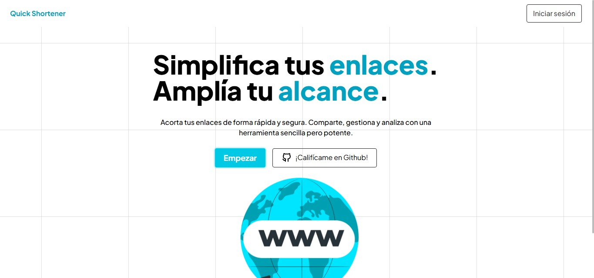
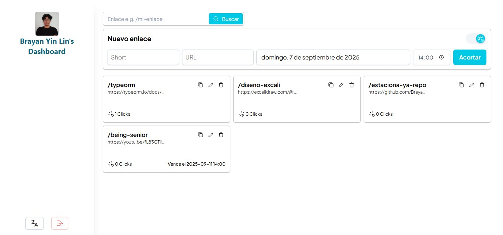
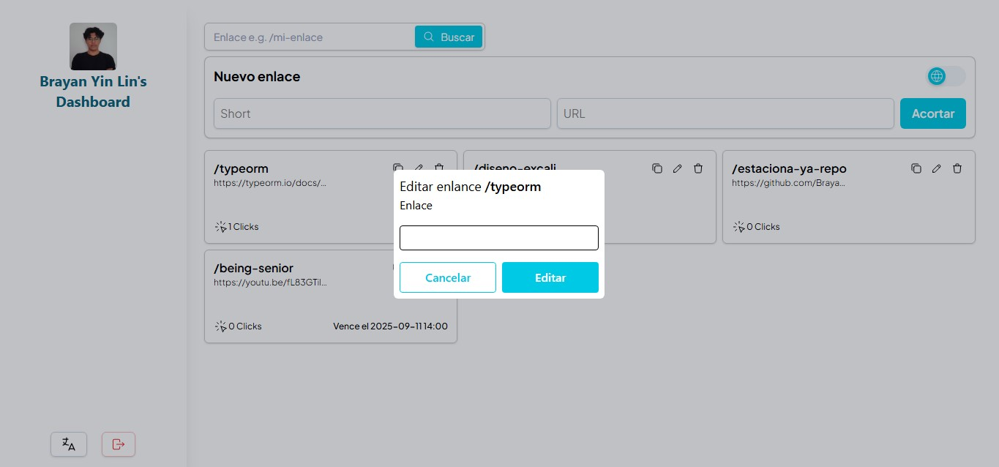
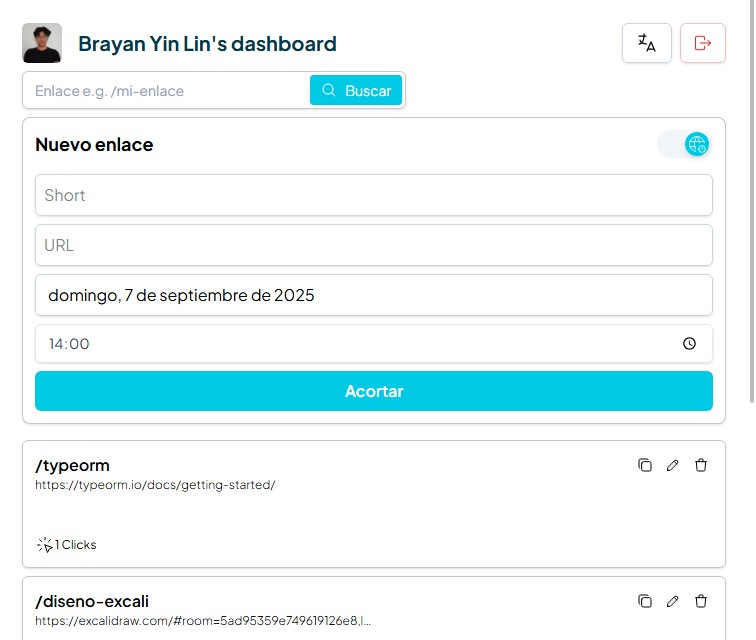

# URL Shortener ✂️

¡Un acortador de URLs simple y potente! Este monorepo contiene todo lo que necesitas para acortar, gestionar y compartir tus enlaces de una manera más sencilla.

## ✨ Características

- **🔗 Acorta URLs:** Transforma enlaces largos en URLs cortas y manejables.
- **🔐 Autenticación:** Inicia sesión con tu cuenta de Google o GitHub.
- **📊 Dashboard:** Administra tus enlaces: visualiza, edita y elimina.
- **🚀 Redirección Rápida:** Redirecciones eficientes para una experiencia de usuario fluida.
- **📱 Diseño Responsivo:** Interfaz adaptable a cualquier tamaño de pantalla.

## 📸 Capturas de Pantalla

|              Página Principal               |                 Dashboard de Usuario                 |
| :-----------------------------------------: | :--------------------------------------------------: |
|  |                 |
|     _Vista principal de la aplicación._     | _Panel de control para gestionar todos tus enlaces._ |

|                Edición de Enlace                 |                 Diseño Responsivo                 |
| :----------------------------------------------: | :-----------------------------------------------: |
|     |     |
| _Modal para editar la información de un enlace._ | _Vista de la aplicación en un dispositivo móvil._ |

## 🛠️ Tech Stack

| Área              | Tecnología                                     |
| :---------------- | :--------------------------------------------- |
| **Frontend**      | React, Vite, TypeScript, Tailwind CSS, Zustand |
| **Backend**       | Node.js, Express, TypeScript, TypeORM          |
| **Base de Datos** | PostgreSQL, Redis                              |
| **Auth**          | Passport.js (Google & GitHub), JWT             |
| **Varios**        | pnpm Workspaces, Docker, Nginx                 |

## 📂 Estructura del Proyecto

Este proyecto es un monorepo gestionado con `pnpm` y está organizado de la siguiente manera:

- `apps/api`: El backend de la aplicación (Node.js/Express).
- `apps/client`: El frontend de la aplicación (React/Vite).

## 🚀 Empezando

Para levantar el proyecto localmente, sigue estos pasos.

### Prerrequisitos

- [Node.js](https://nodejs.org/) (v20+)
- [pnpm](https://pnpm.io/installation)
- [Docker](https://www.docker.com/get-started)

### Pasos de Instalación

1.  **Clona el repositorio:**

    ```bash
    git clone https://github.com/tu-usuario/url-shortener-app.git
    cd url-shortener-app
    ```

2.  **Instala las dependencias:**

    ```bash
    pnpm install
    ```

3.  **Configura las variables de entorno:**
    Crea un archivo `.env` en la raíz del proyecto y añade las variables necesarias. Puedes usar el siguiente ejemplo como base:

    ```env
    # API
    PORT=5373
    API_BASE=http://localhost:5373

    # Base de Datos
    POSTGRES_HOST=localhost
    POSTGRES_DATABASE=db_shortener
    POSTGRES_USER=admin
    POSTGRES_PASSWORD=mysecretpassword

    # Auth
    JWT_SECRET=supersecretjwtkey

    # Google OAuth
    GOOGLE_CLIENT=your_google_client_id
    GOOGLE_SECRET=your_google_client_secret
    GOOGLE_CALLBACK=http://localhost:5373/api/auth/google/callback

    # GitHub OAuth
    GITHUB_CLIENT=your_github_client_id
    GITHUB_SECRET=your_github_client_secret
    ```

4.  **Inicia la base de datos:**
    ```bash
    docker compose up -d
    ```

## 📜 Scripts Disponibles

| Comando                 | Descripción                                    |
| :---------------------- | :--------------------------------------------- |
| `pnpm dev:client`       | Inicia el servidor de desarrollo del cliente.  |
| `pnpm dev:api`          | Inicia el servidor de desarrollo de la API.    |
| `pnpm dev:api:worker`   | Inicia el worker de la API en modo desarrollo. |
| `pnpm start:api`        | Inicia la API en modo producción.              |
| `pnpm start:api:worker` | Inicia el worker de la API en modo producción. |
| `pnpm build`            | Compila ambos proyectos para producción.       |
| `pnpm test:api`         | Ejecuta los tests de la API.                   |

## 📖 Documentación de la API

La documentación de la API sigue la especificación OpenAPI 3.0 y se encuentra en `apps/api/src/shared/docs/openapi.yml`.
